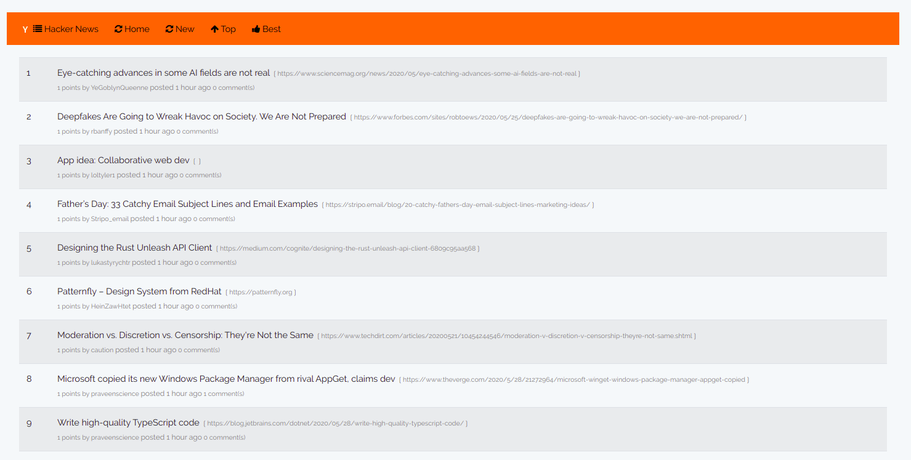

## License

The Laravel framework is open-sourced software licensed under the [MIT license](https://opensource.org/licenses/MIT).

## Setup

## Steps

##clone the repository

Change the DB connections on this file .env find on your root directory
DB_HOST=127.0.0.1

DB_PORT=3306

DB_DATABASE=HackerNewsPosts_DB

DB_USERNAME=YOUR USER NAME

DB_PASSWORD=YOUR PASSWORD

I have attached the populated DB

under the folder /database/seeds
HCNewsDB.sql

creating your own DB
create your schema and update the DB details on the .env file in the root directory 
#Then
run this command

$ php artisan serve

$ php artisan migrate

It will give clean DB  structure no data

## THEN

on you project directory run the following commands

Please make sure you have composer and npm installed

https://getcomposer.org/

https://nodejs.org/en/

# Dependencies
$ composer install

$ npm run watch-poll

## Finally
$ php artisan serve 

$ php artisan schedule:run