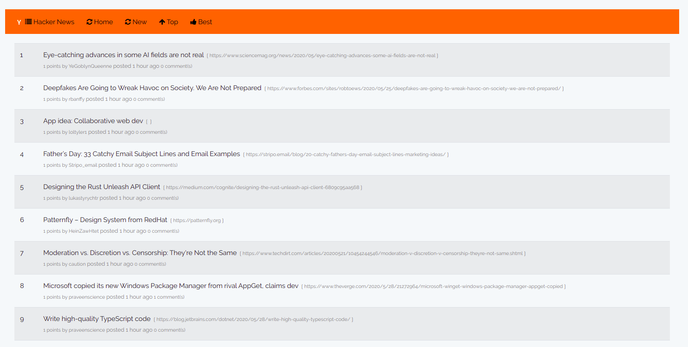
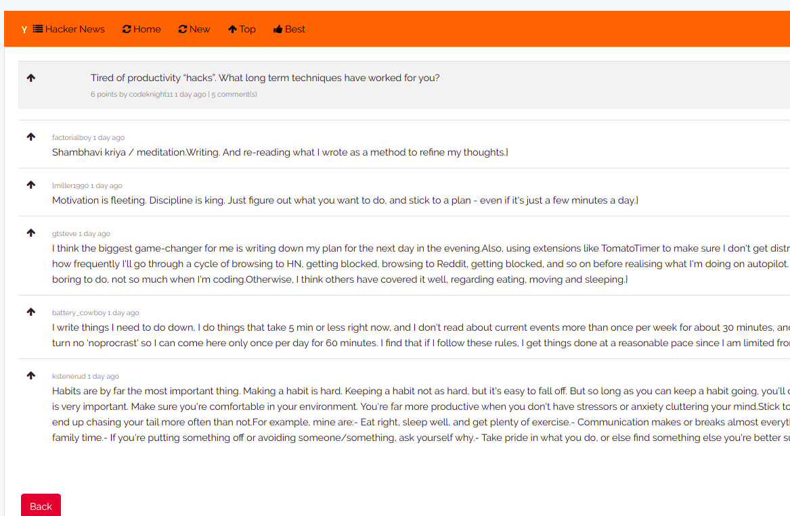
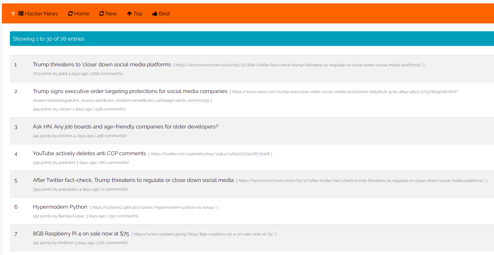

## License

The Laravel framework is open-sourced software licensed under the [MIT license](https://opensource.org/licenses/MIT).

## Setup

## Steps

##clone the repository

Open your terminal,

Go to your to the cloned repository on your terminal 

Change the DB connections on this file .env found on your root directory

DB_HOST=127.0.0.1

DB_PORT=3306

DB_DATABASE=HackerNewsPosts_DB

DB_USERNAME=YOUR USER NAME

DB_PASSWORD=YOUR PASSWORD

I have attached the populated DB under the folder 

/database/seeds
HCNewsDB.sql

creating your own DB
create your schema and update the DB details on the .env file in the root directory 

#Then
run this command

$ php artisan migrate

It will give clean DB  structure no data

## THEN

on you project directory run the following commands

Please make sure you have composer installed

https://getcomposer.org/

# Dependencies
$ composer install

If you are using a clean DB
$ php artisan schedule:run

## Finally
$ php artisan serve 